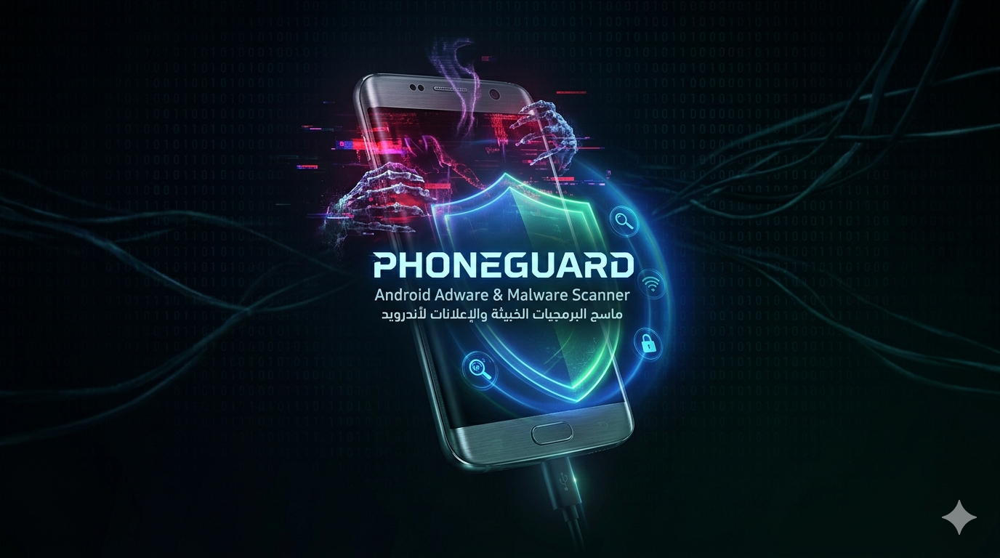

<!-- PhoneGuard README -->

<div align="center">



# PhoneGuard v5.0
### ⚡ Android Adware & Malware Scanner
### ماسح البرمجيات الخبيثة والإعلانات لأندرويد


</div>

---

## 📖 About · نبذة عن الأداة

| 🇬🇧 English | 🇸🇦 العربية |
|---|---|
| PhoneGuard is a powerful Python CLI tool that connects to your Android device via ADB to detect adware, malware, suspicious permissions, and harmful background processes — then helps you remove them instantly. | PhoneGuard هي أداة Python قوية تعمل من سطر الأوامر، تتصل بجهازك الأندرويد عبر ADB للكشف عن برامج الإعلانات والبرمجيات الخبيثة والصلاحيات المشبوهة والعمليات الضارة في الخلفية، وتساعدك على إزالتها فوراً. |

---

## ✨ Features · المميزات

| # | 🇬🇧 Feature | 🇸🇦 الميزة | Description · الوصف |
|---|---|---|---|
| 1 | 🔍 Smart Full Scan | فحص ذكي شامل | Fast & accurate — recommended for daily use |
| 2 | 🧬 Deep Behavioral Scan | فحص سلوكي عميق | Behavioral pattern analysis while app is running |
| 3 | 🌐 Network Traffic Analysis | تحليل حركة الشبكة | Detects connections to known ad servers |
| 4 | 📡 Real-Time Ad Monitor | مراقبة الإعلانات لحظياً | Live 60-second passive monitoring |
| 5 | 🔄 Background Apps Manager | إدارة تطبيقات الخلفية | Kill or uninstall background processes |
| 6 | 🔓 High Permissions Apps | تطبيقات الصلاحيات العالية | Detect & revoke dangerous permissions |
| 7 | 🗑️ Smart Uninstall | إزالة ذكية للتطبيقات | Remove apps by name, number, or partial match |
| 8 | 📄 Scan Reports | تقارير الفحص | Auto-saved Markdown reports with full details |
| 9 | 🌍 Bilingual UI | واجهة ثنائية اللغة | Full English & Arabic interface support |

---

## 🚦 Risk Levels · مستويات الخطر

Every scanned app receives a risk score from **0 to 100**:

| Level | Score | Meaning · المعنى |
|---|---|---|
| 🔴 **CRITICAL** · خطير | 75–100 | Immediate action required — immediate uninstall recommended |
| 🟠 **HIGH** · مرتفع | 50–74 | Highly suspicious — strong indicators of malicious behavior |
| 🟡 **MEDIUM** · متوسط | 25–49 | Suspicious patterns found — review recommended |
| 🟢 **LOW** · منخفض | 0–24 | Minimal risk — likely safe |

### What PhoneGuard detects · ما تكشفه الأداة

- ✅ Dangerous permissions (CAMERA, RECORD_AUDIO, SEND_SMS, READ_CONTACTS, etc.)
- ✅ Known ad libraries embedded in apps
- ✅ Boot receivers (apps that auto-start with system)
- ✅ Accessibility service abuse
- ✅ Behavioral patterns via Quark Engine
- ✅ Connections to known ad/malware servers

---

## ⚙️ Requirements · المتطلبات

| Requirement | Details | المتطلب |
|---|---|---|
| 🐍 Python | 3.8 or newer | بايثون 3.8 أو أحدث |
| 📱 ADB | Android Debug Bridge installed | ADB مثبت |
| 🎨 rich | `pip3 install rich` | مكتبة rich |
| 🔓 USB Debugging | Enabled on Android device | تصحيح USB مفعّل |
| 💻 OS | Windows / macOS / Linux | أي نظام تشغيل |

---

## 🚀 Installation · التثبيت

### Step 1 — Clone the repository · استنساخ المستودع

```bash
git clone https://github.com/ibrahimmustafacv/PhoneGuard
cd PhoneGuard
python3 main.py
